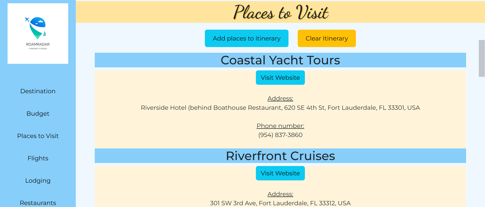
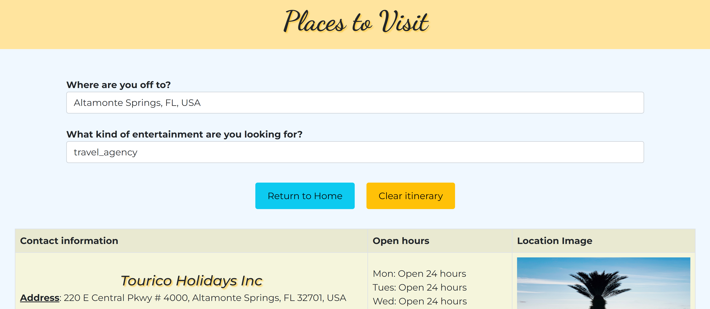
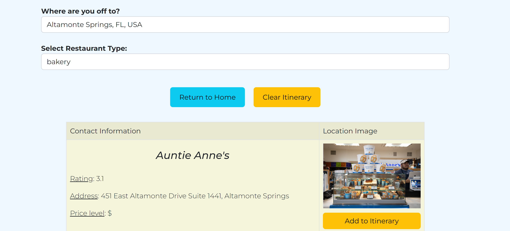
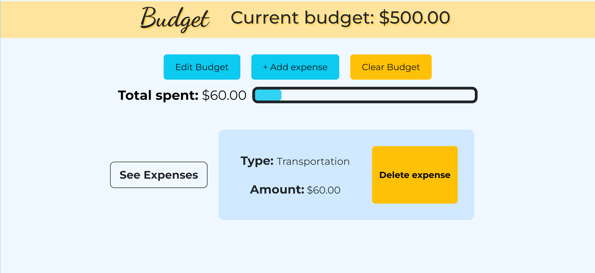
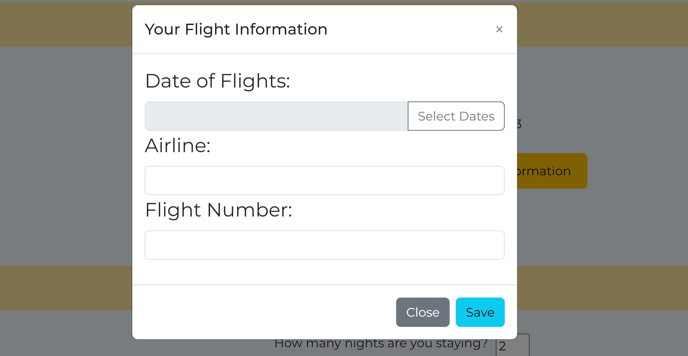
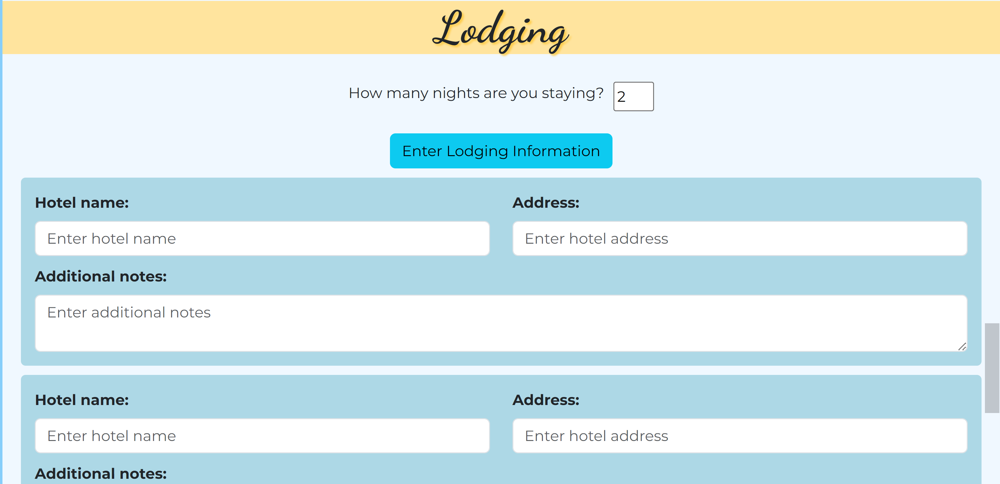

# RoamRadar: Travel Itinerary
A travel itinerary storage app. Updated from version without mobile use.

# Project screenshots

## How to Operate
RoamRadar is a travel itinerary where everything is stored in local storage. Begin by selecting a location, then feel free to fill in trip information. This includes hotel information, budgetting with sections for user to input types spent, places to visit, restaurants to eat at, and flight information. 

Every location input is aided with Google Autocomplete API and location information is retrieved using Google Places API.

## Challenges Faced
The hardest part of this project was the implementation of the Google maps API to get location information. Not only that, but then taking this information and displaying it not only in the page where I originally got the information, but saving places through user selection and then displaying them in a different HTML page.

Another difficulty-- reading through my team-mates' code and figuring out what they meant to do, what was working, and what was not working. Updating the code and pretty much revamping the website took a lot of patience and helped me learn how others code differently! 

## New concepts learned
I learned an incredible quantity of layout improvement techniques. From something as simple as having the navigation bar display certain elements (the website's logo, for example) depending on image size, to making links and websites lauch on a new blank tab, to making navigation links flow smoothly when clicked.

### Previous Versions 
This project was originally made as part of a team over a period of two weeks. After the team finished the project, I decided I wanted to update it to be more mobile-friendly and finish polishing css and other functionalities. The original team was composed of:

https://github.com/Saragar710 (Sara)
Created the restaurant.html page, js, and css. Also created index.html.

https://github.com/Angeldog27 (Abigail)
Created the budget.html, js, and css.

https://github.com/NicoleT27 (Nicole)
Created the location.html page, js, and css. She also created the nav bar that is present in most pages.

https://github.com/Yowiesenfeld (Yo)
Created the hotels.html, js, and css. Also created the flight2.html, js, and css.

I was responsible for the login page and the thingsToDo.html and their associated css and js files.

Together, we made the navbar.html page, which houses the main layout of our itinerary page. 

### The original repository can be found at:
https://github.com/Saragar710/Travel-Itinerary

